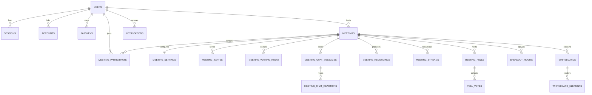

# Enterprise Google Meet Platform: Architecture & Implementation Plan

A production-grade, distributed, real-time video conferencing platform built with **Next.js (App Router, React 19)**, **ElysiaJS (Bun Runtime)**, **Mediasoup SFU (Multi-Worker WebRTC)**, **PostgreSQL (Drizzle ORM)**, **Redis (Presence, State, Ephemeral Caching)**, and **BullMQ (Background Jobs & Pipelines)**, managed within a **Turborepo monorepo**.

advanced works

---

## User Review Required

> [!IMPORTANT]
> **Monorepo Migration**: The current repository contains top-level `/client` and `/server` folders. We will restructure these into `apps/client` and `apps/server`, and create `packages/shared-types`, `packages/shared-validation`, `packages/shared-utils`, `packages/shared-events`, and `packages/shared-config`.
> 
> **Native WebRTC on Windows vs Linux/Docker**: Mediasoup compiles native C++ worker binaries (`mediasoup-worker`). While running on Windows local machines, Docker will be the recommended production runtime for the Mediasoup worker pool, while Bun runs the application layer.

---

## 1. Monorepo Folder Structure

```
meet/
├── .github/
│   └── workflows/
│       ├── ci.yml
│       ├── cd-staging.yml
│       └── cd-production.yml
├── apps/
│   ├── client/                      # Next.js 15+ App Router, React 19, Tailwind CSS v4, shadcn/ui
│   │   ├── src/
│   │   │   ├── app/                 # Server Components first, streaming SSR, route groups
│   │   │   │   ├── (auth)/          # Auth layouts & pages: /login, /register, /verify, /forgot-password
│   │   │   │   ├── (dashboard)/     # /dashboard, /schedule, /recordings, /analytics, /settings
│   │   │   │   ├── (meeting)/       # /[meetingId], /[meetingId]/lobby, /[meetingId]/breakout
│   │   │   │   ├── (admin)/         # /admin, /admin/users, /admin/meetings, /admin/audit
│   │   │   │   ├── api/             # Edge/Server route handlers for Next.js internal endpoints
│   │   │   │   ├── layout.tsx
│   │   │   │   └── page.tsx
│   │   │   ├── features/            # Feature-sliced modules
│   │   │   │   ├── auth/            # Auth forms, Passkey hooks, OAuth triggers
│   │   │   │   ├── meeting/         # Room grid, controls, media streams, layout switcher
│   │   │   │   ├── mediasoup/       # Device, transports, producers, consumers hooks & store
│   │   │   │   ├── chat/            # Real-time chat messages, reactions, mentions, file sharing
│   │   │   │   ├── whiteboard/      # Canvas, fabric.js/excalidraw sync, tools
│   │   │   │   ├── screen-share/    # Display media capture, quality adjuster
│   │   │   │   ├── polls/           # Live voting UI, poll creation modal
│   │   │   │   ├── recording/       # Cloud/local trigger UI, status indicator
│   │   │   │   └── moderation/      # Kick, mute, waiting room queue, ban modal
│   │   │   ├── components/          # Reusable shared UI primitives
│   │   │   ├── hooks/               # useMediaStream, useActiveSpeaker, useBandwidth, useShortcuts
│   │   │   ├── stores/              # Zustand state slices (meetingStore, mediaStore, chatStore)
│   │   │   ├── providers/           # QueryClientProvider, TooltipProvider, ThemeProvider, SocketProvider
│   │   │   └── lib/                 # Client utilities, api client (Eden / Fetch)
│   │   ├── package.json
│   │   └── tsconfig.json
│   │
│   └── server/                      # ElysiaJS + Bun Runtime Clean Architecture Modular Monolith
│       ├── src/
│       │   ├── core/                # Core DDD abstractions, Result types, DomainEvent publisher
│       │   ├── config/              # Env validation, config loaders
│       │   ├── infrastructure/
│       │   │   ├── database/        # Drizzle ORM client, connection pool, migrations
│       │   │   ├── redis/           # Redis client, distributed locks (Redlock), Pub/Sub, presence
│       │   │   ├── mediasoup/       # Worker manager, Router balancer, Transport pool, AudioLevelObserver
│       │   │   ├── queues/          # BullMQ worker instances (transcoding, emails, webhook triggers)
│       │   │   ├── storage/         # MinIO / AWS S3 client (presigned URLs, uploads)
│       │   │   ├── mailer/          # Nodemailer SMTP provider & email templates
│       │   │   └── telemetry/       # OpenTelemetry tracer, Prometheus metrics, Pino logger
│       │   ├── modules/             # Domain Feature Modules (Clean Architecture / DDD)
│       │   │   ├── auth/            # Domain, application (services, use-cases), infra, presentation (Elysia routes)
│       │   │   ├── users/
│       │   │   ├── meetings/
│       │   │   ├── participants/
│       │   │   ├── waiting-room/
│       │   │   ├── signaling/       # Native WebSocket signaling server & event routing
│       │   │   ├── webrtc/          # Mediasoup bridge: createTransport, produce, consume, restartIce
│       │   │   ├── chat/
│       │   │   ├── recordings/      # FFmpeg consumer pipe, S3 sink, HLS generator
│       │   │   ├── streaming/       # RTMP forwarder (YouTube, Facebook, Twitch)
│       │   │   ├── whiteboards/
│       │   │   ├── polls/
│       │   │   ├── breakout/
│       │   │   ├── files/
│       │   │   ├── notifications/
│       │   │   ├── calendar/
│       │   │   ├── analytics/
│       │   │   ├── moderation/
│       │   │   └── admin/
│       │   ├── index.ts             # App bootstrap, Elysia server instance, plugin mounting
│       │   └── socket.ts            # Native WebSocket server upgrade & handler
│       ├── package.json
│       └── tsconfig.json
│
├── packages/
│   ├── shared-types/                # Universal TypeScript interfaces, enums, DTOs, WebRTC protocols
│   ├── shared-validation/           # Zod schemas for forms, API bodies, socket payloads
│   ├── shared-utils/                # Pure helper functions (UUIDv7, dates, strings, math)
│   ├── shared-events/               # Domain event definitions, Redis pub/sub channels & message contracts
│   └── shared-config/               # Shared ESLint, Prettier, TypeScript, Tailwind config presets
│
├── docker/
│   ├── client.Dockerfile
│   ├── server.Dockerfile
│   ├── coturn/                      # STUN/TURN coturn.conf
│   └── grafana/                     # Prometheus & OpenTelemetry dashboards
├── docker-compose.yml               # Postgres, Redis, MinIO, MailHog, Coturn, Server, Client
├── turbo.json                       # Turborepo task pipeline configuration
├── package.json                     # Root monorepo workspace definition
└── bun.lock
```

---

## 2. Complete Database Schema (26 Entities)

All tables adhere to:
* **UUIDv7 Primary Keys** (time-ordered sequential UUIDs for optimal B-Tree performance)
* **`createdAt` and `updatedAt`** automatic timestamps
* **`deletedAt`** soft-deletion support
* **Full-text search** vectors (Postgres tsvector on messages, meetings, users)
* **Composite and Partial Indexes** for fast multi-tenant and room lookups

### Entity Relationship Overview



### Table Specifications:
1. `users`: ID, email, name, password_hash, avatar_url, cover_url, bio, timezone, language, theme, presence_status, role (`USER`, `MODERATOR`, `ADMIN`, `SUPER_ADMIN`), is_verified, banned_at, created_at, updated_at, deleted_at.
2. `sessions`: ID, user_id, refresh_token_hash, user_agent, ip_address, device_name, device_type, is_revoked, expires_at, created_at, updated_at.
3. `accounts`: ID, user_id, provider (`google`, `github`, `microsoft`), provider_account_id, access_token, refresh_token, expires_at, created_at.
4. `passkeys`: ID, user_id, credential_id, public_key, counter, device_type, backed_up, transports, name, created_at, last_used_at.
5. `meetings`: ID, host_id, title, description, slug/code, type (`INSTANT`, `SCHEDULED`, `RECURRING`, `PERSONAL`), access_level (`PUBLIC`, `PRIVATE`, `INVITE_ONLY`), scheduled_start_at, scheduled_end_at, actual_start_at, actual_end_at, status (`SCHEDULED`, `ACTIVE`, `ENDED`, `CANCELLED`), recurrence_rule, created_at, updated_at, deleted_at.
6. `meeting_settings`: ID, meeting_id, waiting_room_enabled, auto_recording, mute_on_join, camera_off_on_join, disable_screen_share, disable_chat, disable_file_share, disable_reactions, lock_meeting, allow_guest_users, max_participants, created_at, updated_at.
7. `meeting_participants`: ID, meeting_id, user_id, display_name, avatar_url, role (`HOST`, `CO_HOST`, `PARTICIPANT`, `GUEST`), is_audio_muted, is_video_muted, is_screen_sharing, is_hand_raised, joined_at, left_at, connection_status.
8. `meeting_invites`: ID, meeting_id, email, invited_by, role, token, status (`PENDING`, `ACCEPTED`, `DECLINED`, `EXPIRED`), expires_at, created_at.
9. `meeting_waiting_room`: ID, meeting_id, user_id, guest_identifier, display_name, status (`PENDING`, `ADMITTED`, `REJECTED`), joined_at, processed_at, processed_by.
10. `meeting_chat_messages`: ID, meeting_id, sender_id, recipient_id (null for public, user_id for private), reply_to_id, content, message_type (`TEXT`, `FILE`, `SYSTEM`, `POLL`), is_pinned, is_deleted, created_at, updated_at.
11. `meeting_chat_reactions`: ID, message_id, user_id, emoji, created_at.
12. `meeting_recordings`: ID, meeting_id, triggered_by, type (`CLOUD`, `LOCAL`), format (`MP4`, `HLS`), file_url, file_size_bytes, duration_seconds, status (`INITIALIZING`, `RECORDING`, `PROCESSING`, `READY`, `FAILED`), s3_key, created_at, updated_at.
13. `meeting_streams`: ID, meeting_id, platform (`YOUTUBE`, `FACEBOOK`, `CUSTOM_RTMP`), rtmp_url, stream_key, status (`STARTING`, `STREAMING`, `STOPPED`, `ERROR`), created_at, updated_at.
14. `meeting_polls`: ID, meeting_id, created_by, question, options (JSONB), is_anonymous, is_active, closed_at, created_at.
15. `poll_votes`: ID, poll_id, user_id, option_index, created_at.
16. `breakout_rooms`: ID, meeting_id, name, duration_minutes, is_active, created_at, updated_at.
17. `breakout_participants`: ID, breakout_room_id, participant_id, joined_at, left_at.
18. `whiteboards`: ID, meeting_id, title, is_locked, created_at, updated_at.
19. `whiteboard_elements`: ID, whiteboard_id, element_id, type (`DRAW`, `RECT`, `CIRCLE`, `TEXT`, `STICKY`), data (JSONB), created_by, version, updated_at.
20. `notifications`: ID, user_id, title, body, type (`MEETING_REMINDER`, `INVITE`, `RECORDING_READY`, `CHAT_MENTION`, `SYSTEM`), data (JSONB), is_read, read_at, created_at.
21. `notification_preferences`: ID, user_id, email_reminders, email_invites, push_new_messages, in_app_sounds, updated_at.
22. `file_uploads`: ID, uploader_id, meeting_id, file_name, file_size_bytes, mime_type, s3_key, file_url, scan_status (`CLEAN`, `INFECTED`, `PENDING`), created_at.
23. `analytics_events`: ID, meeting_id, user_id, event_name, properties (JSONB), timestamp.
24. `audit_logs`: ID, actor_id, target_type, target_id, action, ip_address, user_agent, details (JSONB), created_at.
25. `reports`: ID, reporter_id, reported_user_id, reported_meeting_id, reason, category, status (`OPEN`, `INVESTIGATING`, `RESOLVED`, `DISMISSED`), created_at, resolved_at.
26. `user_presence`: ID, user_id, status (`ONLINE`, `AWAY`, `BUSY`, `OFFLINE`), active_meeting_id, socket_id, last_heartbeat_at.

---

## 3. Mediasoup Multi-Worker WebRTC SFU Architecture

```mermaid
graph TD
    subgraph Client Browser
        CamMic[Webcam & Mic Stream]
        Screen[Screen Share Stream]
        MediasoupClient[mediasoup-client Device]
    end

    subgraph Elysia Signaling / WS
        Signaling[Bun Native WebSocket Gateway]
        RoomRouter[Room & Peer State Coordinator]
    end

    subgraph Mediasoup SFU Cluster
        WorkerPool[Mediasoup Worker Pool (1 Worker per CPU Core)]
        Router1[Router Room A]
        Router2[Router Room B]
        PipeRouter[Router-to-Router PipeTransport for Scaled Rooms]
    end

    subgraph Recording & Transcoding
        PlainTransport[PlainTransport / RTP Stream]
        FFmpeg[FFmpeg Consumer Process]
        S3Bucket[MinIO / AWS S3 Storage]
    end

    CamMic --> MediasoupClient
    Screen --> MediasoupClient
    MediasoupClient <-->|Signaling JSON-RPC| Signaling
    Signaling <--> RoomRouter
    RoomRouter --> WorkerPool
    WorkerPool --> Router1
    Router1 -->|Send Transport| MediasoupClient
    Router1 -->|Recv Transport| MediasoupClient
    Router1 -.->|Inter-Router Pipe| Router2
    Router1 --> PlainTransport
    PlainTransport --> FFmpeg
    FFmpeg --> S3Bucket
```

* **Worker Pool Balancing**: Round-robin and load-evaluated router distribution across `os.cpus().length` Mediasoup workers.
* **Simulcast Profiles**:
  * High: 1080p / 720p @ 30fps (2500 kbps)
  * Medium: 480p @ 30fps (800 kbps)
  * Low: 240p @ 15fps (200 kbps)
* **SVC Support**: VP9 / AV1 temporal/spatial scalability mode (`L3T3`).
* **Active Speaker**: Native `AudioLevelObserver` on Mediasoup routers emitting `volumes` events (threshold -60dB, interval 400ms), broadcasting active speaker updates to front-end for automatic layout focusing.
* **Network Resilience**: Automatic ICE Restart handling on connection state drops, dynamic bandwidth estimation via Transport Congestion Control (BWE / REMB / TCC).

---

## 4. Redis Ephemeral State & Event Pipeline

* **Presence Tracking**: `user:presence:{userId}` string key with 60s TTL, refreshed by 20s WebSocket heartbeat.
* **Room Active State**: `meeting:room:{meetingId}:participants` hash storing ephemeral socket IDs and peer stats.
* **Distributed Locks**: Redlock algorithm for admitting waiting room guests and creating single-active cloud recording sessions.
* **Pub/Sub Cluster**: Multi-node signaling message dissemination via Redis channels `room:broadcast:{meetingId}`.
* **Rate Limiting**: Sliding-window counter in Redis (`ratelimit:{ip}:{action}`).

---

## 5. Native WebSocket Signaling Protocol Specification

JSON-RPC 2.0 styled typed message protocol over native Bun WebSocket:
* `meeting:join`: `{ meetingId, token, displayName, peerCapabilities }`
* `meeting:leave`: `{ meetingId, reason }`
* `webrtc:createWebRtcTransport`: `{ direction: 'send' | 'recv', sctpCapabilities }`
* `webrtc:connectWebRtcTransport`: `{ transportId, dtlsParameters }`
* `webrtc:produce`: `{ transportId, kind, rtpParameters, appData }`
* `webrtc:consume`: `{ producerId, rtpCapabilities }`
* `webrtc:restartIce`: `{ transportId }`
* `chat:send`: `{ meetingId, recipientId, content, messageType }`
* `poll:create` / `poll:vote`
* `whiteboard:update`: `{ elements, action }`

---

## 6. Implementation Stages

1. **Stage 1: Monorepo & Core Infrastructure Setup**
   * Configure root `package.json`, `turbo.json`, and Bun workspace definitions.
   * Restructure existing code into `apps/client` and `apps/server`.
   * Initialize `packages/shared-types`, `packages/shared-validation`, `packages/shared-utils`, `packages/shared-events`, `packages/shared-config`.
2. **Stage 2: Database Design & Complete Drizzle Schemas**
   * Implement all 26 production Drizzle schema files with UUIDv7, relations, composite indexes, soft deletes, and enums in `apps/server/src/infrastructure/database/schema/`.
   * Export database migration and seeding scripts.
3. **Stage 3: Mediasoup SFU & Backend Core Engine**
   * Build worker pool manager, router balancer, WebRTC transport factory, audio level observer, and plain transport for recording.
   * Implement Native WebSocket signaling server with JSON-RPC validation.
   * Wire Redis presence, room caching, and Redlock distributed locks.
4. **Stage 4: Domain Modules & REST/RPC APIs**
   * Implement Auth (Passkeys/WebAuthn, Refresh token rotation, OAuth).
   * Implement Meetings, Waiting Room, Chat, Polls, Breakout, Whiteboard, and Admin modules.
   * Set up BullMQ worker queues for emails, video processing, and audit logs.
5. **Stage 5: Next.js Client Architecture & UI Components**
   * Integrate Zustand stores (`useMeetingStore`, `useMediaStore`, `useChatStore`).
   * Implement WebRTC mediasoup-client custom hooks with auto-reconnect and device handling.
   * Build Google Meet responsive grid view, active speaker spotlight, sidebar, pre-join lobby, waiting room, and chat panel.
6. **Stage 6: DevOps, Docker, Observability & Security**
   * Dockerfiles with multi-stage caching and Coturn TURN/STUN server configuration.
   * `docker-compose.yml` orchestrating Postgres, Redis, MinIO, Coturn, Server, and Client.
   * OpenTelemetry and Prometheus instrumentation with Pino logger.
   * GitHub Actions CI/CD workflows.

---

## Verification Plan

### Automated Verification:
* Monorepo lint and type-checking across all workspaces:
  `bun run lint` & `bun run typecheck` via Turbo.
* Drizzle schema validation and migration dry-run:
  `bun run db:generate` in server workspace.
* Unit tests for shared-validation and utils:
  `bun test` in packages.

### Manual & Integration Verification:
* Docker container composition health checks (`docker compose up --build`).
* Multi-user media call testing: two browser sessions connecting to the same meeting ID, verifying audio/video negotiation, simulcast layer switching, and chat synchronization.
