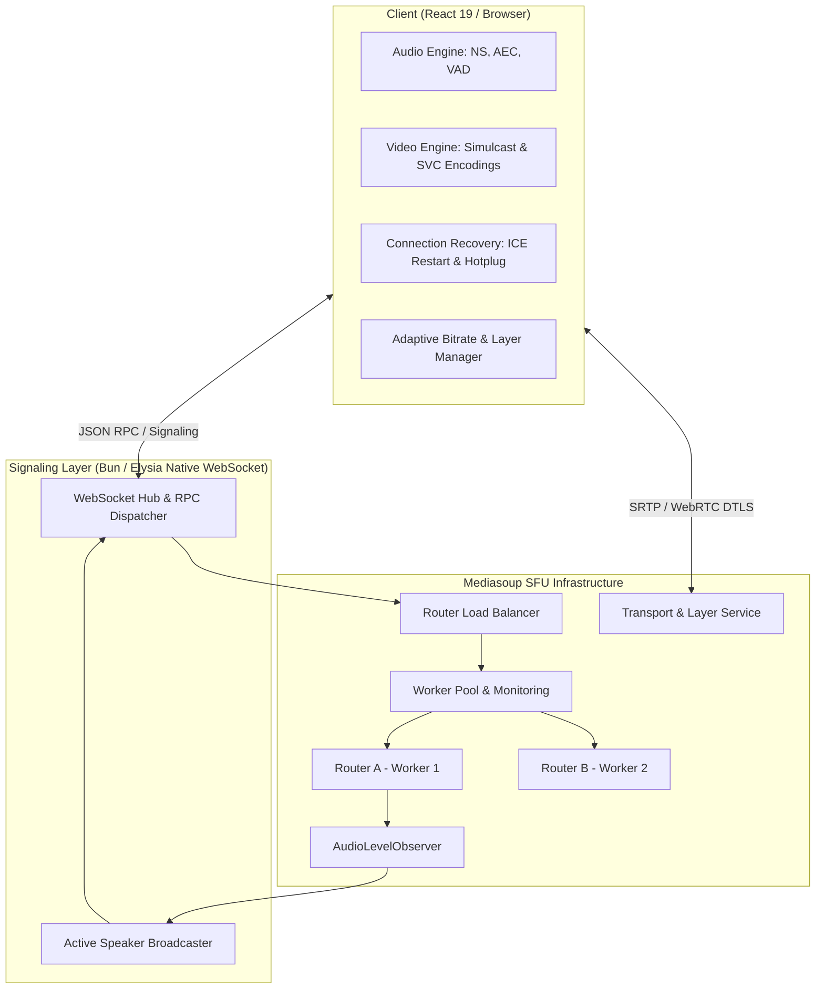

# Scalable Mediasoup WebRTC Architecture Plan

Architecture and implementation plan for enterprise-grade, scalable **Mediasoup WebRTC SFU**, following Clean Architecture, strict `< 150 lines` per file modularization, and production-grade connection resiliency.

---

## User Review Required

> [!IMPORTANT]
> - **Codecs Supported**: VP8, VP9 (with SVC `L3T3`), H.264 (Constrained Baseline/High), AV1 Ready (`L3T3`).
> - **Audio Engine**: Full WebRTC hardware/software DSP with noise suppression, acoustic echo cancellation, voice activity detection (VAD), Opus In-Band FEC & DTX, and server-side `AudioLevelObserver` for real-time active speaker ranking.
> - **Resiliency**: Auto ICE Restart on network switch (WiFi ⇄ Cellular), WebSocket backoff reconnection, and device hotplugging recovery (`navigator.mediaDevices.ondevicechange` with `producer.replaceTrack`).
> - **File limit constraint**: Every component, service, and handler strictly `< 150 lines`.

---

## 1. System Architecture

---

## 2. Server-Side Scalable Architecture (`apps/server/src/infrastructure/mediasoup/`)

Modularize into focused services (< 150 lines each):

1. **[config.ts](file:///c:/Users/SHAKIL/Desktop/code/meet/apps/server/src/infrastructure/mediasoup/config.ts)**:
   - Configures VP8, VP9 (SVC `L3T3`), H264, and AV1 codecs.
   - Opus audio configuration with `usedtx: 1`, `useinbandfec: 1`.
   - Transport listenInfos with UDP/TCP fallback and port ranges (`40000-49999`).
2. **[worker-pool.ts](file:///c:/Users/SHAKIL/Desktop/code/meet/apps/server/src/infrastructure/mediasoup/worker-pool.ts)**:
   - Multi-worker lifecycle management across available CPU cores.
   - Worker monitoring: `worker.getResourceUsage()` collecting CPU user/sys time, memory usage.
   - Auto worker resurrection on crash/death.
3. **[router-balancer.ts](file:///c:/Users/SHAKIL/Desktop/code/meet/apps/server/src/infrastructure/mediasoup/router-balancer.ts)**:
   - Load balancing routers across workers by least-loaded worker score (active router count + CPU metric).
   - Room-to-Router mapping with thread affinity.
4. **[transport-service.ts](file:///c:/Users/SHAKIL/Desktop/code/meet/apps/server/src/infrastructure/mediasoup/transport-service.ts)**:
   - Creation of Send (Producer) and Recv (Consumer) WebRtcTransports.
   - Congestion control, BWE (Bandwidth Estimation) settings, and ICE restart handler (`transport.restartIce()`).
5. **[audio-observer-service.ts](file:///c:/Users/SHAKIL/Desktop/code/meet/apps/server/src/infrastructure/mediasoup/audio-observer-service.ts)**:
   - Manages Mediasoup `AudioLevelObserver` per router (`threshold: -60 dBov`, `interval: 350ms`).
   - Emits debounced `activeSpeaker` events with volume levels.
6. **[layer-manager.ts](file:///c:/Users/SHAKIL/Desktop/code/meet/apps/server/src/infrastructure/mediasoup/layer-manager.ts)**:
   - Handles dynamic layer switching: `consumer.setPreferredLayers({ spatialLayer, temporalLayer })`.
   - Consumer pausing/resuming based on viewport visibility or thumbnail state.
7. **[room-manager.ts](file:///c:/Users/SHAKIL/Desktop/code/meet/apps/server/src/infrastructure/mediasoup/room-manager.ts)**:
   - High-level coordinator for room peers, transports, producers, and consumers.

---

## 3. WebRTC Signaling Sub-Handlers (`apps/server/src/modules/signaling/`)

Add WebRTC RPC operations:
- `webrtc:createWebRtcTransport`: Creates send or recv transport.
- `webrtc:connectWebRtcTransport`: Connects DTLS parameters.
- `webrtc:produce`: Registers audio/video tracks with simulcast/SVC metadata.
- `webrtc:consume`: Connects consumer with codec capabilities negotiation.
- `webrtc:restartIce`: Triggers ICE restart and returns new ICE parameters.
- `webrtc:setConsumerLayers`: Client requests spatial/temporal layer switch.
- `webrtc:getWorkerStats`: Returns real-time health metrics of all Mediasoup workers.

---

## 4. Client-Side WebRTC Media Engine (`apps/client/src/`)

Modularize client logic (< 150 lines per file):

1. **[services/webrtc/audio-constraints.ts](file:///c:/Users/SHAKIL/Desktop/code/meet/apps/client/src/services/webrtc/audio-constraints.ts)**:
   - High-fidelity constraints: `echoCancellation: true`, `noiseSuppression: true`, `autoGainControl: true`, `sampleRate: 48000`.
2. **[services/webrtc/video-encodings.ts](file:///c:/Users/SHAKIL/Desktop/code/meet/apps/client/src/services/webrtc/video-encodings.ts)**:
   - **Simulcast**: 3 spatial streams:
     - High: 1080p/720p @ 2.5 Mbps, 30 fps
     - Medium: 360p @ 600 kbps, 24 fps (scaleDown 2)
     - Low: 180p @ 150 kbps, 15 fps (scaleDown 4)
   - **SVC**: Scalable video configurations for VP9 / AV1 (`scalabilityMode: "L3T3"`).
3. **[services/webrtc/connection-recovery.ts](file:///c:/Users/SHAKIL/Desktop/code/meet/apps/client/src/services/webrtc/connection-recovery.ts)**:
   - Transport `connectionstatechange` handler: triggers ICE restart on `"failed"` or `"disconnected"`.
   - Network change watcher: `navigator.connection.addEventListener('change', ...)` to proactively renegotiate.
   - Device hotplug watcher: `navigator.mediaDevices.addEventListener('devicechange', ...)` with seamless `producer.replaceTrack({ track })` without tearing down transports.
4. **[services/webrtc/adaptive-bitrate.ts](file:///c:/Users/SHAKIL/Desktop/code/meet/apps/client/src/services/webrtc/adaptive-bitrate.ts)**:
   - Inspects consumer score and packet loss to request lower/higher spatial layers.
5. **[hooks/use-mediasoup.ts](file:///c:/Users/SHAKIL/Desktop/code/meet/apps/client/src/hooks/use-mediasoup.ts)**:
   - Wires all services together while staying cleanly under 150 lines.

---

## Verification Plan

### Automated & Unit Checks
- Monorepo compilation & typecheck: `bun x tsc --noEmit`
- Line count validator across all custom files (enforcing `< 150 lines`).

### WebRTC Flow Verification
1. Verify multi-worker initialization on server startup (`numWorkers = CPUs`).
2. Verify worker balancing logic assigns new rooms to least loaded worker.
3. Verify simulcast encodings send 3 distinct RTP streams.
4. Verify ICE restart request generates and binds new ICE credentials.
5. Verify audio observer detects volume spikes and emits `activeSpeaker` event.
