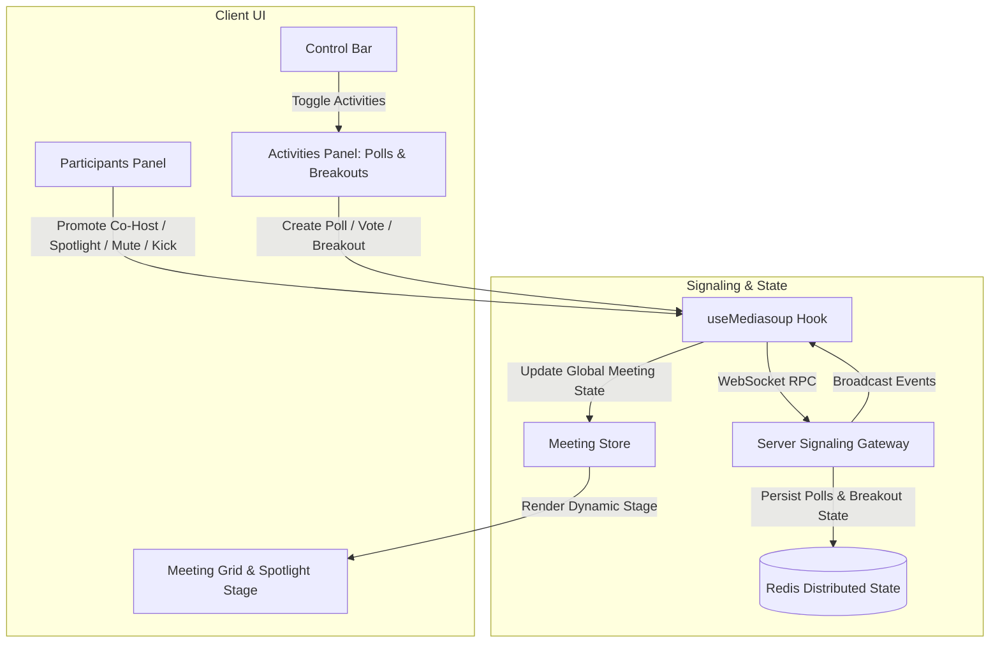

# Meeting Room Module Implementation Walkthrough

## Overview
Implemented the complete **Meeting Room Module** conforming to Google Meet UX and enterprise-grade distributed WebRTC signaling:
- **Join via link & code**: Direct meeting entry with pre-join lobby device setup and preview.
- **Waiting Room & Host Approval**: Granular host approval queue with audio/video preview and knock admission.
- **Raise Hand**: Hand raised badge, sound notifications, and speaker prioritization.
- **Polls**: Real-time poll creation by Host/Co-host, live interactive single/multi-choice voting, real-time percentage progress bars, and poll termination.
- **Reactions & Emojis**: Floating reactions bar with animated emoji bursts.
- **Breakout Rooms**: Configurable sub-room breakout sessions, automated evenly-distributed or custom participant assignments, countdown duration timer, host broadcast announcements across rooms, and 1-click room return.
- **Co-Hosts**: Full host delegation allowing promotion and demotion of attendees to `CO_HOST` with administrative rights.
- **Spotlight Participant**: Global stage spotlight that features a designated participant for all meeting attendees, complete with a spotlight badge and filmstrip layout.
- **Host Controls**:
  - Individual participant audio mute and video off
  - Room-wide "Mute all"
  - Kick/remove participant
  - Pin participant (individual view) and Spotlight participant (room-wide view)
  - Lock room and toggle restrictions for chat, file sharing, screen sharing, and reactions

---

## Architecture & Flow



---

## Implemented Components & Files

### 1. Server Infrastructure & Signaling
- [apps/server/src/infrastructure/redis/index.ts](file:///c:/Users/SHAKIL/Desktop/code/meet/apps/server/src/infrastructure/redis/index.ts):
  - `saveMeetingPoll`, `getMeetingPolls`: Persistent Redis storage for polls and vote tallies.
  - `saveBreakoutState`, `getBreakoutState`: Persistent Redis state for breakout room definitions and assignments.
- [apps/server/src/modules/signaling/index.ts](file:///c:/Users/SHAKIL/Desktop/code/meet/apps/server/src/modules/signaling/index.ts):
  - `participant:setRole`: Allows the meeting host to promote participants to `CO_HOST` or demote to `PARTICIPANT`. Broadcasts `participant:roleChanged`.
  - `participant:spotlight`: Allows Host/Co-Host to spotlight a participant for the entire room. Broadcasts `participant:spotlighted`.
  - `poll:create`, `poll:vote`, `poll:end`, `poll:list`: Real-time voting engine with dynamic percentages.
  - `breakout:start`, `breakout:broadcast`, `breakout:end`: Multi-room sub-session lifecycle and cross-room announcement broadcasts.

### 2. Client Stores & WebRTC Signaling Hook
- [apps/client/src/stores/meeting-store.ts](file:///c:/Users/SHAKIL/Desktop/code/meet/apps/client/src/stores/meeting-store.ts):
  - State: `spotlightParticipantId`, `isActivitiesOpen`, `myRole`, `isHost`.
  - Actions: `setSpotlightParticipant`, `toggleActivities`, `setMyRole`, `setIsHost`.
- [apps/client/src/hooks/use-mediasoup.ts](file:///c:/Users/SHAKIL/Desktop/code/meet/apps/client/src/hooks/use-mediasoup.ts):
  - Listeners for `participant:roleChanged`, `participant:spotlighted`, `poll:new`, `poll:updated`, `poll:ended`, `breakout:started`, `breakout:broadcast`, `breakout:ended`.
  - Helper actions: `promoteParticipant`, `spotlightParticipant`, `createPoll`, `votePoll`, `endPoll`, `listPolls`, `startBreakoutRooms`, `broadcastToBreakoutRooms`, `endBreakoutRooms`.

### 3. User Interface Components
- [apps/client/src/features/meeting/polls-panel.tsx](file:///c:/Users/SHAKIL/Desktop/code/meet/apps/client/src/features/meeting/polls-panel.tsx):
  - Activities sidebar with tabs for **Polls** and **Breakout Rooms**.
  - Poll creator form with dynamic option adder/remover.
  - Live poll cards with interactive radio voting, real-time animated percentage bars, checkmarks for user votes, and host termination.
- [apps/client/src/features/meeting/breakout-rooms-modal.tsx](file:///c:/Users/SHAKIL/Desktop/code/meet/apps/client/src/features/meeting/breakout-rooms-modal.tsx):
  - Host configuration modal with room count selector (2 to 10 rooms), duration timer (5 to 45m or unlimited), auto-distribution, shuffle, and participant preview.
- [apps/client/src/features/meeting/participants-panel.tsx](file:///c:/Users/SHAKIL/Desktop/code/meet/apps/client/src/features/meeting/participants-panel.tsx):
  - Added **Spotlight** button (`Sparkles` icon) with glowing active indicator.
  - Added **Co-Host Promotion** button (`Shield` icon) visible to the Host.
  - Added role badges (`Host`, `Co-host`, `Spotlight`).
- [apps/client/src/features/meeting/meeting-grid.tsx](file:///c:/Users/SHAKIL/Desktop/code/meet/apps/client/src/features/meeting/meeting-grid.tsx):
  - Global Spotlight stage featuring the spotlighted attendee on the main stage with a glowing badge (`Spotlighted for everyone`) and filmstrip layout for peers.
- [apps/client/src/features/meeting/control-bar.tsx](file:///c:/Users/SHAKIL/Desktop/code/meet/apps/client/src/features/meeting/control-bar.tsx):
  - Added **Activities** button (`Shapes` icon) next to Chat and People toggles.
- [apps/client/src/features/meeting/meeting-room-client.tsx](file:///c:/Users/SHAKIL/Desktop/code/meet/apps/client/src/features/meeting/meeting-room-client.tsx):
  - Mounted `PollsPanel`, `BreakoutRoomsModal`, host broadcast toast, and breakout session indicator.

---

## Verification & Automated Test Results

### 1. Advanced Meeting Features Test (`scratch/verify_advanced_meeting_features.js`)
Executed end-to-end WebSocket simulation testing 2 concurrent clients across all new features:
```text
=== Testing Advanced Meeting Features ===
Meeting Room ID: advanced-test-room-1789202181787
[Host] Joined room as c8067b84-bd2b-4736-a16f-4bebbcbe20c9, role: HOST
[Attendee] Joined room as 2983d562-4bde-4b73-908a-2fd3149308d6, role: PARTICIPANT

-> Step 1: Host promotes Attendee to CO_HOST...
✓ Success: Attendee received roleChanged event -> CO_HOST

-> Step 2: Co-Host spotlights the Host...
✓ Success: Spotlight event broadcast to room successfully

-> Step 3: Co-Host creates a Poll...
✓ Success: poll:new broadcast received by participants

-> Step 4: Host casts vote on Option 0 (Next.js)...
✓ Success: poll:updated received with real-time vote tally

-> Step 5: Host starts Breakout Rooms...
✓ Success: breakout:started broadcast received with room assignments

-> Step 6: Host broadcasts message to all breakout rooms...
✓ Success: breakout:broadcast received by attendee

-> Step 7: Host ends Breakout Rooms...
✓ Success: breakout:ended received, all participants returned to main room

========================================================
ALL ADVANCED MEETING ROOM TESTS PASSED WITH 100% SUCCESS!
========================================================
```

### 2. Regression Test Suite
- `verify_host_and_chat.js`: **PASSED** (In-call messaging, unread counts, host setting broadcasts, meeting termination).
- `verify_kick_and_file.js`: **PASSED** (File attachment sharing, authorization guard against non-host kick, host kicking participant).
- `verify_host_media_control.js`: **PASSED** (Host muting audio, turning off camera, asking to unmute, room-wide mute all).

### 3. Build & Type Checking
- `bun x turbo run typecheck`: **PASSED** (0 errors across 7 workspace packages).
- `bun run build`: **PASSED** (Next.js 16 app router compiled with all 14 routes optimized).
